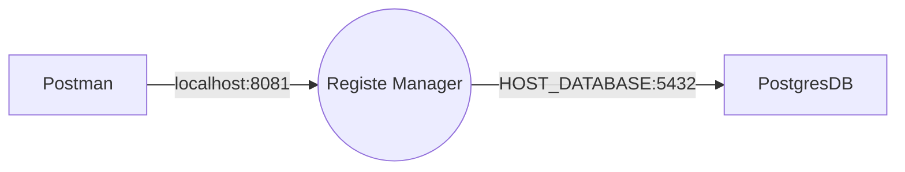
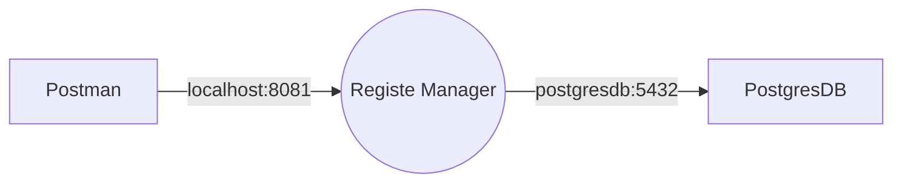

# Projeto: Gerenciamento de Usuários
Este projeto é responsável por gerenciar usuários, incluindo a criação, edição, exclusão e validação de dados, como a restrição de unicidade no campo de email.

Funcionalidades
* Adicionar novos usuários e endereços.
* Editar informações de usuários e endereços existentes.
* Excluir usuários e endereços.
* Garantir que o campo de email seja único no banco de dados.

### Estrutura do Banco de Dados
O projeto utiliza uma tabela chamada user_account. A seguinte restrição foi adicionada para garantir a unicidade do campo de email:
alter table if exists user_account
add constraint unique_user_account_email unique (email)

Tabelas user_account_role e address.

### Tecnologias Utilizadas
* Linguagem: Java e SQL
* Banco de Dados: [Postgres](https://www.postgresql.org/)
* Frameworks: [Spring Boot 3.4.5](https://start.spring.io/)
* Dependencias: (Spring Security)[https://docs.spring.io/spring-security/reference/index.html], 
*(jjwt)[https://javadoc.io/doc/io.jsonwebtoken/jjwt-api/latest/index.html], 
* (JPA)[https://docs.spring.io/spring-data/jpa/reference/index.html],
* (lombok)[https://projectlombok.org/features/], 
* (mapstruct)[https://mapstruct.org/documentation/], (jackson)[https://javadoc.io/doc/com.fasterxml.jackson.core/jackson-core/latest/index.html],
* (openfeign)[https://docs.spring.io/spring-cloud-openfeign/docs/current/reference/html/]
* (OpenApi)[https://springdoc.org/]
* (actuator)[https://docs.spring.io/spring-boot/docs/2.0.x/actuator-api/html/]
* JDK: 17
* IDE: [Intellij](https://www.jetbrains.com/idea/)
* Gerenciado de dependencias: [Apache Maven 3.9.9](https://maven.apache.org/)
* Container: [Docker](https://www.docker.com/) e [Docker Hub](https://hub.docker.com/)
* Ferramentas: [Postman](https://www.postman.com/) [Google Chrome
   Versão 136.0.7103.93 (Versão oficial) 64 bits](https://www.google.com/intl/pt-BR/chrome/), [PGAdmin](https://www.pgadmin.org/), [Beekeeper](https://www.beekeeperstudio.io/)

### Como Executar
1. Clone o repositório: git clone https://github.com/alberes/register-manager
2. Configure o banco de dados:
- Banco de dados: register_manager
- Tabelas: user_account, user_account_role e address
Certifique-se de que o banco de dados está configurado corretamente.
A aplicação irá criar as tabelas automaticamento caso não exista ou execute o script antes que se encontra no projeto.
Localizar o arquivo [SUB_DIRETORIOS]/register-manager/DDL.sql
3. Usando uma imagem Docker (Opcional)
4. Tempo de sessão está configurado para 30 minutos

 Um opção é criar um container docker com a imagem do Postgres, abaixo um exemplo que configurar usuário, senha e cria o banco de dados.
```
docker run --name postgresdb -p 5432:5432 -e POSTGRES_PASSWORD=postgres -e POSTGRES=postgres -e POSTGRES_DB=register_manager -d postgres:16.3
```
4. Executar o projeto
- Abrir o terminal na raiz do projeto [SUB_DIRETORIOS]/register-manager e exeuctar o comando abaixo para gerar o pacote.
```
mvn -DskipTests=true clean package
```
- No termial entrar no diretório [SUB_DIRETORIOS]/register-manager/target
```
java -jar register-manager-0.0.1-SNAPSHOT.jar
```
A aplicação subirá na porta 8081

### Testes
1. Carga inicial:
   - A aplicação faz uma carga inicial para facilitar os testes.
   - Perfil:
     - ADMIN tem acesso a todos os recursos
     - USER apenas ao próprio recurso e não tem tem permissão para criar usuário :-D
2. Swagger
     - http://localhost:8081/swagger-ui/index.html
3. Observabilidade e métricas
    - (Monitoramento)[http://localhost:9090/actuator]
      - (Log)[http://localhost:9090/actuator/logfile]
      - (Metricas)[http://localhost:9090/actuator/metrics]
      - (DataSource)[http://localhost:9090/actuator/metrics/hikaricp.connections.active]
      - (Memória)[http://localhost:9090/actuator/metrics/jvm.buffer.memory.used]
      - (CPU)[http://localhost:9090/actuator/metrics/process.cpu.usage]
      - (Autorzação)[http://localhost:9090/actuator/metrics/spring.security.authorizations.active]
      - (Sessões)[tomcat.sessions.active.current]
2. Testes usando Postman
    - Localize a collection que se encontra no diretório [SUB_DIRETORIOS]/register-manager/register-manager.postman_collection
    - Importar no Postman
    - A aplicação criou alguns usuários:
      - admin@admin.com.com
      - manager@manager.com
      - user@user.com
      - 
3. Exemplos:
   - Recursos
     - [Login](#login) - /api/v1/login
     - Users - /api/v1/users
       - [Criar](#userscriar)
       - [Consultar](#usersconsultar )
	   - [Usuário logado](#consultarusuariologado)
       - [Atualizar](#usersatualizar)
       - [Excluir](#usersexcluir)
     - Addresses - /api/v1/users/(userId)/addresses
        - [Criar](#addressescriar)
        - [Consultar](#addressesconsultar )
        - [Consultar Via CEP](#addressesconsultarcep)
        - [Atualizar](#addressesatualizar)
        - [Excluir](#addressesexcluir)

## Postman	
<a id="login"></a>
   - Login
	   - `curl --location 'http://localhost:8081/api/v1/login' \
--header 'Content-Type: application/json' \
--data-raw '{
    "username": "user@user.com",
    "password": "password"
}'`
<a id="userscriar"></a>
- Users - Criar
	- curl --location 'http://localhost:8081/api/v1/users' \
--header 'Content-Type: application/json' \
--header 'Authorization: Bearer [TOKEN_OBTIDO_LOGIN]' \
--data-raw '{
    "name": "Posteman User",
    "email": "postman@postman.com",
    "password": "postman123456",
    "role": "USER"
}'
<a id="usersconsultar"></a>
	- Users - Consultar
		- `curl --location 'http://localhost:8081/api/v1/users/(ID)' \
--header 'Authorization: Bearer [TOKEN_OBTIDO_LOGIN]'`
<a id="consultarusuariologado"></a>
	- Consultar os dados do usuário logado
		- `curl --location 'http://localhost:8081/api/v1/users/authenticated' \
--header 'Authorization: Bearer [TOKEN_OBTIDO_LOGIN]'`
<a id="userscriar"></a>
	- Users - Consultar usuários com paginação
		- `curl --location 'http://localhost:8081/api/v1/users/(ID)/addresses?page=0&linesPerPage=10&orderBy=publicArea&direction=ASC' \
--header 'Authorization: Bearer [TOKEN_OBTIDO_LOGIN]'`
<a id="usersatualizar"></a>
	- Users - Atualizar
		- `curl --location --request PUT 'http://localhost:8081/api/v1/users/(ID)' \
--header 'Content-Type: application/json' \
--header 'Authorization: Bearer [TOKEN_OBTIDO_LOGIN]' \
--data '{
    "name": "Name updated"
}'`
<a id="usersexcluir"></a>
	- Users - Excluir
		- `curl --location --request DELETE 'http://localhost:8081/api/v1/users/(ID)' \
--header 'Authorization: Bearer [TOKEN_OBTIDO_LOGIN]'`
<a id="addressescriar"></a>
	- Addresses - Criar
		- `curl --location 'http://localhost:8081/api/v1/users/(UserId))/addresses' \
--header 'Content-Type: application/json' \
--header 'Authorization: [TOKEN_OBTIDO_LOGIN]'\
--data '{
    "publicArea": "Avenida Principal",
    "number": 15,
    "additionalAddress": "",
    "neighborhood": "Centro",
    "city": "São Paulo",
    "state": "SP",
    "zipCode": "06185987"
}'`
<a id="addressesconsultar"></a>
	- Addresses - Consultar endereço do usuário
		- `curl --location 'http://localhost:8081/api/v1/users/(userId)/addresses/(addressId)' \
--header 'Authorization: Bearer [TOKEN_OBTIDO_LOGIN]'`
<a id="addressesconsultarcep"></a>
	- Addresses - Consultar endereço VIA CEP para preencher o endereço do usuário
		- `curl --location 'http://localhost:8081/api/v1/users/(userId)/addresses/zipcode/(CEP)' \
--header 'Authorization: Bearer [TOKEN_OBTIDO_LOGIN]'`
<a id="userscriar"></a>
	- Addresses - Consultar usuários com paginação
		- `curl --location 'http://localhost:8081/api/v1/users/(userId)/addresses?page=0&linesPerPage=10&orderBy=publicArea&direction=ASC' \
--header 'Authorization: Bearer [TOKEN_OBTIDO_LOGIN]'`
<a id="addressesatualizar"></a>
	- Addresses - Atualizar
		- `curl --location --request PUT 'http://localhost:8081/api/v1/users/(userId)/addresses/(addressId)' \
--header 'Content-Type: application/json' \
--header 'Authorization: Bearer [TOKEN_OBTIDO_LOGIN]' \
--data '{
    "publicArea": "Avenida Principal Atualizada",
    "number": 16,
    "additionalAddress": "updated",
    "neighborhood": "Centro  updated",
    "city": "Osasco  updated",
    "state": "SC",
    "zipCode": "89625741"
}'`
<a id="addressesexcluir"></a>
	- Addresses - Excluir
		- `curl --location --request DELETE 'http://localhost:8081/api/v1/users/(userId)/addresses/(addressId)' \
--header 'Authorization: Bearer [TOKEN_OBTIDO_LOGIN]'`

## Docker
No projeto já existe uma imagem versionada no Docker Hub e precisa apenas ter o ambiente Docker.
Abrir um terminal no mesmo diretório do arquivo docker-compose.yaml e execute o comando abaixo.
- Subir o ambiente:
	- `docker-compose up -d`
- Baixar o ambiente
	- `docker-compose down`

## Comunicação com banco de dados Postgres
Comunicação usando banco de dados local, remoto ou apenas uma imagem docker

Comunicação entre ambientes virtuais usando Docker

